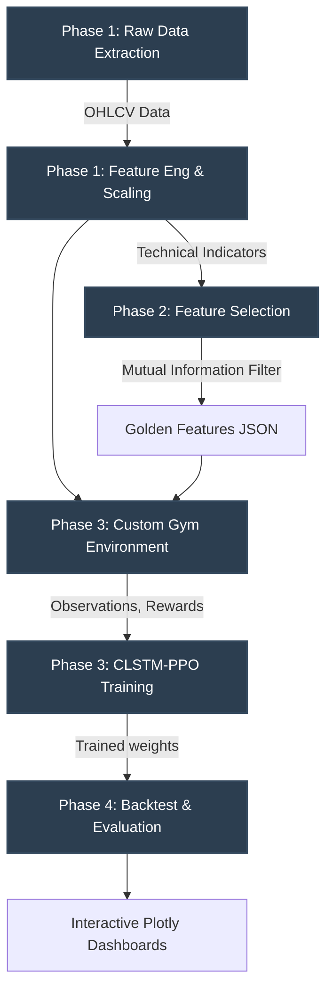
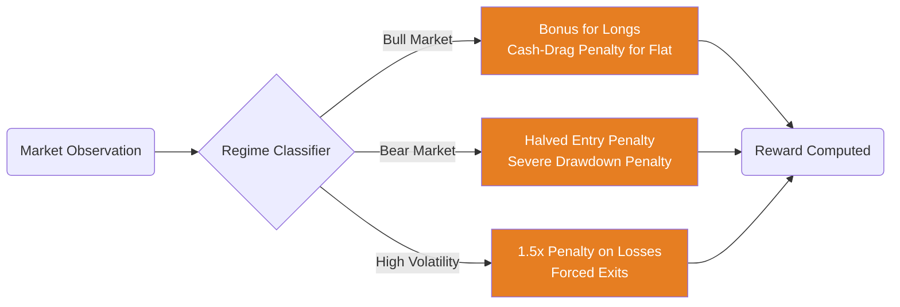

# RL-Based Cryptocurrency Trader 🚀📈


A state-of-the-art Deep Reinforcement Learning (DRL) cryptocurrency trading system utilizing a **CLSTM (Convolutional Long Short-Term Memory)** network combined with the **Proximal Policy Optimization (PPO)** algorithm. 

This repository introduces a novel **Asymmetric Regime-Aware Reward Function** that mathematically forces the agent to heavily prioritize capital preservation in bear markets while aggressively capturing relief rallies, yielding exceptional risk-adjusted returns (Sharpe Ratio 9.39) during severe market drawdowns.

---

## 🌟 Key Results (Out-of-Sample Test Set)
**Testing Period:** `2024-07-01` to `2024-12-31` (Severe Bear Market with -34% Max Drawdown)

| Metric | CLSTM-PPO Agent | Buy & Hold |
|--------|-------|------------|
| **Total Return** | **+16.44%** | -17.53% |
| **Max Drawdown** | **0.71%** | 34.27% |
| **Sharpe Ratio** | **9.39** | -4.33 |
| **Trading Style** | Highly selective (27 trades) | Passive |

*(Agent sat safely in cash for ~90% of the bear market, entirely avoiding the crash, while exclusively sniping profitable short-term bounces.)*

---

## 🧠 System Architecture

The trading pipeline is modularized into distinct phases, ensuring clean separation between data extraction, feature engineering, and reinforcement learning.



### 🎯 The Asymmetric Regime-Aware Reward Function
Our custom environment classifies the market dynamically (Bull, Bear, High Volatility) using rolling standard deviations and moving averages, and alters the agent's reward structure accordingly:



---

## 🛠️ Installation & Setup

1. **Clone the repository:**
```bash
git clone https://github.com/Raj-Karmhe/RL-based-cryptocurrency-trader.git
cd RL-based-cryptocurrency-trader
```

2. **Install dependencies:**
```bash
pip install -r requirements.txt
```

---

## 🚀 Usage Guide

### Option 1: Run the Full Pipeline
You can run the entire pipeline from data extraction to model evaluation in one go.
```bash
python run_full_pipeline.py
```

### Option 2: Step-by-step Execution

**Phase 1: Extract Data & Engineer Features**
```bash
python phase1_data_extraction.py
python phase1_feature_engineering.py
```

**Phase 2: Feature Selection** (Auto-selects top 'golden' features via Mutual Information)
```bash
python phase2_feature_selection.py
```

**Phase 3: Train the CLSTM-PPO Agent**
```bash
python phase3_train.py
```

**Phase 4: Test & Visualize** (Evaluates the trained model on unseen test data)
```bash
# Evaluate on Test Set
python phase4_test_and_visualize.py --model models/clstm_ppo_paper_reward_long_only_all.zip --dataset test

# Evaluate on Validation Set
python phase4_test_and_visualize.py --model models/clstm_ppo_paper_reward_long_only_all.zip --dataset val
```
*Outputs interactive HTML Plotly dashboards in the `results/` folder.*

---

## 📁 Repository Structure
```
.
├── config.py                     # Central hyperparameters & paths
├── phase1_data_extraction.py     # Downloads OHLCV data via CCXT
├── phase1_feature_engineering.py # Calculates TA features & standard scaling
├── phase2_feature_selection.py   # Mutual info & Spearman correlation filtering
├── phase3_environment.py         # Custom OpenAI Gym trading environment
├── phase3_model.py               # CLSTM PyTorch architecture for SB3
├── phase3_train.py               # PPO agent training loop
├── phase4_test_and_visualize.py  # Backtesting and Plotly visualization
├── reward_functions.py           # Asymmetric Regime-Aware reward logic
├── run_full_pipeline.py          # Orchestrator script
├── requirements.txt              # Dependencies
├── data/                         # Datasets & Golden Features
├── models/                       # Saved trained models
└── results/                      # Interactive HTML backtest charts
```

---
*Built for the 2026 Mathematics Paper on Asymmetric Reward Functions in DRL Trading.*
