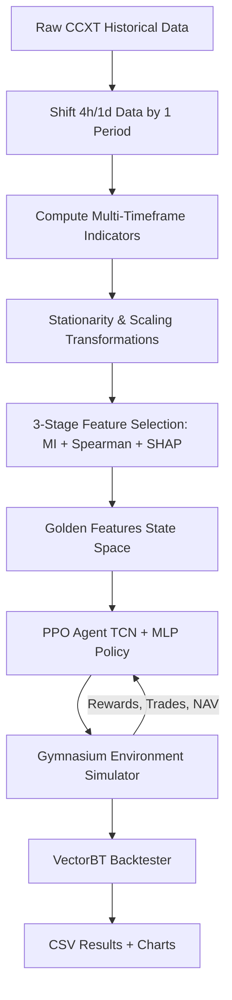
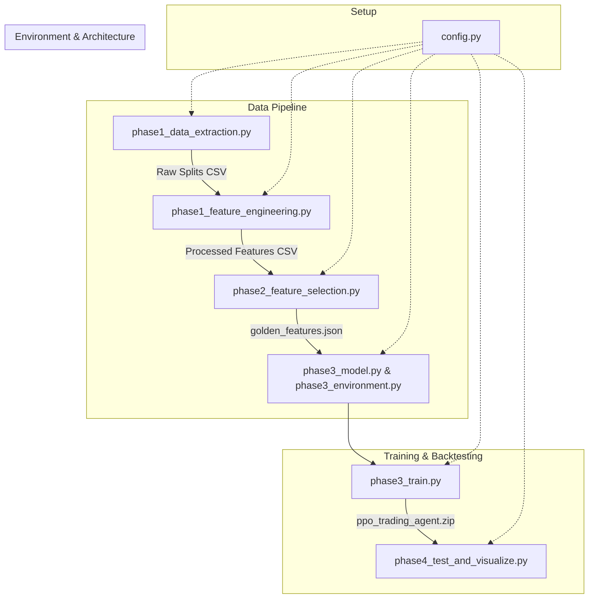
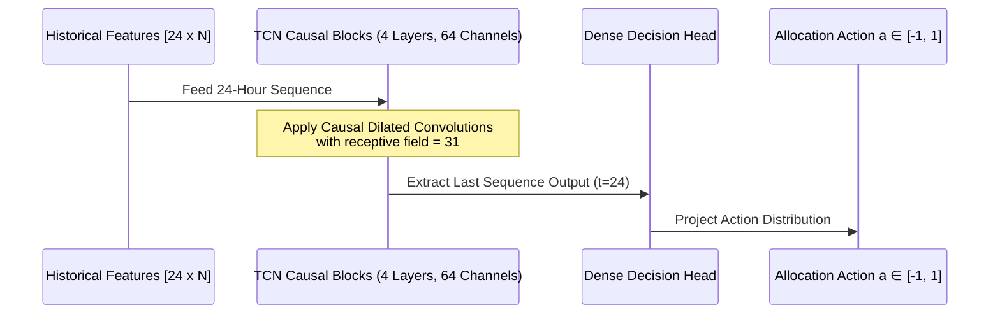
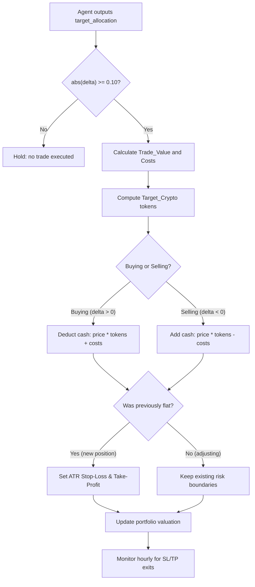

# Technical Design Report: TCN-based PPO Crypto Trading Bot

This report provides an in-depth explanation of the Temporal Convolutional Network (TCN) Reinforcement Learning trading system implemented in the [soc](file:///d:/crypto_RL_Bot/soc) workspace. It covers model training, action execution, sequence processing, and market state classification.

---

## 1. System Architecture Overview

The system operates as a closed-loop Reinforcement Learning agent interacting with a BTC/USDT cryptocurrency trading simulator.



---

## 1.1 Codebase Directory Structure & Execution Flow

To understand the system's operational flow, here is an in-depth explanation of every folder and source file, detailing their functions, logical steps, inputs, and outputs in chronological execution order.

### Directory Structure
*   **[`data/`](file:///d:/crypto_RL_Bot/soc/data)**  
    *Purpose*: Central data warehouse. Contains raw Binance CSV downloads (`BTC_USDT_1h_raw.csv`, etc.), merged multi-timeframe outputs (`merged_all_tfs.csv`), processed split feature sets (`train_features.csv`, `val_features.csv`, `test_features.csv`), the fitted scaling checkpoint (`feature_scaler.pkl`), and the selected state variables configuration (`golden_features.json`).
*   **[`models/`](file:///d:/crypto_RL_Bot/soc/models)**  
    *Purpose*: Model checkpoint storage. Holds the saved PyTorch model weights and PPO optimizer states (`ppo_trading_agent.zip`).
*   **[`results/`](file:///d:/crypto_RL_Bot/soc/results)**  
    *Purpose*: Deliverables output folder. Stores metrics summary files, trade log CSVs, and visualization charts (NAV growth and execution marker plots).



---

### Detailed Source File Breakdown (in Execution Flow Order)

#### **1. Config Setup: [`config.py`](file:///d:/crypto_RL_Bot/soc/config.py)**
*   **Role**: Houses all constant definitions, parameter dictionaries, paths, and neural network hyperparameters.
*   **Key Contents**:
    *   *Indicator Windows*: Definitions for calculations (RSI=14, Stochastic [14, 3], MACD [12, 26, 9], Bollinger Bands [20, 2], ATR=14, SMA [20, 50, 200], Z-score Window=50).
    *   *PPO Hyperparameters*: Sets the optimization configuration (`LEARNING_RATE = 1e-4`, `N_STEPS = 2048`, `BATCH_SIZE = 128`, `N_EPOCHS = 5`, `GAMMA = 0.98`, `CLIP_RANGE = 0.1`, `ENT_COEF = 0.02`, `TARGET_KL = 0.015`).
    *   *Friction & Sizing Limits*: Defines baseline cash (`INITIAL_BALANCE = 100k`), exchange costs (`TRANSACTION_FEE = 0.001`, `SLIPPAGE = 0.0005`), rebalancing thresholds (`MIN_POSITION_CHANGE = 0.10`), and volatility boundaries (`STOP_LOSS_ATR_MULT = 2.0`, `TAKE_PROFIT_ATR_MULT = 3.0`).

#### **2. Data Acquisition: [`phase1_data_extraction.py`](file:///d:/crypto_RL_Bot/soc/phase1_data_extraction.py)**
*   **Role**: Fetches and splits raw OHLCV datasets.
*   **Process Flow**:
    1.  `download_historical_ohlcv(symbol, timeframe, lookback_days)`: Connects to Binance via `ccxt`, handles API rate limits, and downloads daily, 4-hourly, and hourly candles for the lookback window.
    2.  `align_and_merge()`: Synchronizes index frequencies. Higher timeframe candles (daily and 4-hourly) are backward-filled to line up with the hourly candle index.
    3.  `split_data(df)`: Performs chronological splitting relative to the dataset end: Train (first 4 years), Validation (subsequent 6 months), and Test (final 6 months).

#### **3. Preprocessing: [`phase1_feature_engineering.py`](file:///d:/crypto_RL_Bot/soc/phase1_feature_engineering.py)**
*   **Role**: Generates predictive features, enforces stationarity, and normalizes inputs.
*   **Process Flow**:
    1.  `generate_indicators(df)`: Computes 130+ technical indicators spanning trend, momentum, volatility, and volume.
    2.  *Stationarity Transforms*: To prevent domain shift (generalization failure when prices break out of historical ranges), absolute values are transformed:
        *   Moving averages and boundaries are converted to **distance ratios** relative to close price: $\text{Distance} = \frac{\text{Close} - \text{Indicator}}{\text{Close}}$
        *   Oscillators and scale-dependent inputs are normalized via a rolling **Z-score** over a 50-period window.
    3.  *Lookahead Bias Prevention*: All daily and 4-hourly variables are shifted backward by 1 period before merging. This ensures the model at hour $t$ only sees daily/4-hourly candles completed at $t-1$.
    4.  `scale_and_save_splits(symbol, df)`: Fits a `StandardScaler` strictly on the training partition. The fitted scaler is saved to `feature_scaler.pkl` and applied to scale the Validation and Test features.

#### **4. State Space Pruning: [`phase2_feature_selection.py`](file:///d:/crypto_RL_Bot/soc/phase2_feature_selection.py)**
*   **Role**: Selects the most predictive, non-redundant variables for the environment state space.
*   **Process Flow**:
    1.  *Stage 1 (Mutual Information)*: Computes Mutual Information scores between all features and the forward returns ($t+5$). Features in the bottom 30% are dropped.
    2.  *Stage 2 (Spearman Collinearity)*: Computes pair-wise Spearman correlation coefficients. If two features correlate above $0.80$, the feature with the lower MI score is dropped to prevent variance.
    3.  *Stage 3 (LightGBM & TreeSHAP)*: Trains a LightGBM model on the training set to predict forward returns. Calculates Shapley feature importances (TreeSHAP) using the validation set. The top 8 features are saved to `golden_features.json` to define the state space.

#### **5. Model Definition: [`phase3_model.py`](file:///d:/crypto_RL_Bot/soc/phase3_model.py)**
*   **Role**: Defines the Temporal Convolutional Network (TCN) feature extractor.
*   **Process Flow**:
    1.  `Chomp1d`: Slices off the trailing padding elements in PyTorch tensors, enforcing strict causal temporal alignment.
    2.  `TemporalResidualBlock`: Integrates dilated Conv1D layers, modern weight normalization parametrization, ReLU activations, dropout, and residual skip connections.
    3.  `MarketRecurrentExtractor`: Subclasses SB3's features extractor:
        *   Input layer takes a flattened Gymnasium observation vector: shape `(batch, SEQ_LEN * n_features + 2)`.
        *   Slices the first `(SEQ_LEN * n_features)` elements and reshapes them to `(batch, SEQ_LEN, n_features)`.
        *   Transposes to standard 1D convolution dimensions: `(batch, n_features, SEQ_LEN)`.
        *   Passes the tensor through the 4-layer stacked TCN block (dilations $D=[1, 2, 4, 8]$, kernel $K=3$).
        *   Slices the final step vector `tcn_out[:, :, -1]` and concatenates it with the 2 portfolio status variables to pass into actor/critic MLP heads.

#### **6. Trading Simulator: [`phase3_environment.py`](file:///d:/crypto_RL_Bot/soc/phase3_environment.py)**
*   **Role**: Simulates cash, holdings, risk parameters, and rewards.
*   **Process Flow**:
    1.  `_generate_obs()`: Compiles the environment observation vector consisting of the rolled TCN market lookback buffer (`24 x 8` features), the current position allocation fraction, and the position's unrealized PnL.
    2.  `step(action)`: Projects target position allocations:
        *   Calculates capital allocation rebalancing delta.
        *   Executes cash/rebalancing transactions, charging transaction fees ($0.1\%$) and slippage ($0.05\%$).
        *   Triggers fractional order fallbacks if cash balance is insufficient to cover fees.
    3.  *Risk Management (Exits, Lockouts, Drawdowns)*: `TradingRiskManager` monitors ATR-based stop-loss/take-profit exit targets. SL/TP exits and the 30% peak drawdown kill switch are active during **both training and evaluation**, ensuring the agent learns risk-aware behavior in the same environment it is evaluated in. Directional lockouts (24-step re-entry prevention after SL/TP hits) are applied only during evaluation to allow full exploration during training.
    4.  *Column Validation*: On initialization, the environment validates that all golden feature columns exist in the DataFrame, raising a clear `KeyError` with the missing column names if any are absent.
    5.  `_compute_step_reward()`: Calculates the step log-return of the portfolio NAV, penalizing transaction costs (scaled by 1.0 to match actual exchange friction exactly), position changes (reversal penalty scaled to 0.002), and deviation from peak portfolio value (drawdown penalty scaled by 0.1). Portfolio value is floored at $1 (not $0) to prevent log(0) reward spikes during adverse short moves.

#### **7. Training Loop: [`phase3_train.py`](file:///d:/crypto_RL_Bot/soc/phase3_train.py)**
*   **Role**: Orchestrates the reinforcement learning agent's training.
*   **Process Flow**:
    1.  Loads golden feature matrices, fits scaled splits, and configures parallel environments using Stable-Baselines3's `SubprocVecEnv` across 4 CPU cores.
    2.  Sets up policies mapping the TCN extractor (`MarketRecurrentExtractor`).
    3.  Instantiates the PPO solver, setting `target_kl = 0.015` to trigger early stopping on large policy updates.
    4.  Runs the 40,000 timestep training loop, monitors learning curves via `TradingMonitorCallback`, and saves the final policy to the `models/` directory.

#### **8. Evaluator: [`phase4_test_and_visualize.py`](file:///d:/crypto_RL_Bot/soc/phase4_test_and_visualize.py)**
*   **Role**: Performs validation/test evaluations and backtests the agent.
*   **Process Flow**:
    1.  `generate_agent_signals()`: Sets the environment to evaluation mode (`is_eval=True`) and rolls the model through validation/test sets to record target position allocation signals.
    2.  `run_vectorbt_backtest()`: Executes the recorded position signals. For **long-only** strategies, uses VectorBT's `vbt.Portfolio.from_orders` with `targetpercent` sizing. For strategies **containing short positions**, uses a manual portfolio simulation since VectorBT's `targetpercent` does not reliably support negative allocations. Both paths account for fees and slippage. Trade counts and win rates track position reversals and open-at-end positions.
    3.  Computes returns, max drawdowns, annualized Sharpe ratios, and win rates, saving them as CSV and JSON.
    4.  `plot_performance_charts()`: Generates NAV curves comparing the PPO agent's performance to a Buy & Hold benchmark, plotting trade markers at their correct sequence step offsets.

---

## 2. How the Model is Trained

The agent is trained using **Proximal Policy Optimization (PPO)**, a state-of-the-art on-policy Actor-Critic Reinforcement Learning algorithm.

### A. The Actor-Critic Structure
* **Actor (Policy Net)**: Maps the processed market observations to a probability distribution over continuous trading actions.
* **Critic (Value Net)**: Estimates the expected cumulative future return (Value) from the current state. This value baseline is used to compute the "Advantage" of actions, guiding policy updates.

### B. Temporal Feature Extraction (TCN)
Markets are highly non-Markovian; a single snapshot of the current hour is insufficient to understand momentum or trend reversals. Therefore, we utilize a **Temporal Convolutional Network (TCN)**:
* The TCN uses 1D causal convolutions to ensure that future information cannot leak into the past, while dilated convolutions expand the model's receptive field to fully cover the required sequence length without parameter explosion.
* Residual blocks and weight normalization are employed to ensure stable training of the deeper convolutional structure. The output at the last sequence step is compressed and fed to the Actor and Critic MLP heads.

### C. Vectorized Environments
Training is parallelized across `N_ENVS = 4` CPU environments. This speeds up training rollouts and reduces correlation in data collection, stabilizing policy optimization.

---

## 2.1 Architectural Shift: TCN vs. RNN Design Analysis

This section outlines the systemic shift from a Recurrent Neural Network (GRU/LSTM) model to a Temporal Convolutional Network (TCN) feature extractor (`MarketRecurrentExtractor` in `phase3_model.py`).

### A. TCN Mechanics & Temporal Causality
Rather than relying on recurrent hidden states (`h_t`), which are prone to decay and vanishing gradients, the TCN processes multi-timeframe market feature sequences using feed-forward convolutional operations:
* **1D Causal Convolutions**: Achieved by applying asymmetric padding and a rightmost cropping layer (`Chomp1d`). This guarantees that the network's prediction at time $t$ only depends on historical features from indices $\leq t$, eliminating lookahead bias.
* **Dilated Convolutions**: Convolutions are spaced out using exponential dilation factors $D = [1, 2, 4, 8]$. This allows the receptive field to expand exponentially without losing resolution or increasing parameters.
* **Receptive Field (RF) Coverage**: With a kernel size $K = 3$, dilation factors $D = [1, 2, 4, 8]$, and 2 convolutions per block, the total receptive field is:
  $$\text{RF}_{\text{total}} = 1 + \sum_{l=1}^{4} (K - 1) \cdot D_l \cdot 2 = 61 \text{ steps}$$
  Since the lookback window `SEQ_LEN = 24` hours, the receptive field ($61$) completely covers the sequence length, preserving full temporal context.

### B. Tensor Transformations
The structural shift alters how sequence dimensions are handled inside PyTorch:
1. **Gym Space Input**: A flat state vector of size `(batch_size, SEQ_LEN * n_features + 2)`.
2. **Slicing**: Market features are separated from the $2$ portfolio variables (`position_allocation`, `unrealized_pnl`).
3. **Convolution Dimension Prep**: The flat feature vector is reshaped to `(batch_size, SEQ_LEN, n_features)` and transposed to `(batch_size, n_features, SEQ_LEN)`, where features represent the channel dimension.
4. **TCN Block Forward Pass**: Outputs `(batch_size, TCN_HIDDEN_SIZE, SEQ_LEN)`.
5. **Sequence Slicing**: Slices the final step `tcn_out[:, :, -1]` to yield `(batch_size, TCN_HIDDEN_SIZE)`.
6. **Concatenation & Bottleneck**: Merges with the $2$ portfolio status variables to pass `(batch_size, TCN_HIDDEN_SIZE + 2)` into the MLP actor/critic heads.

### C. Integration with Capital Allocation & Position Sizing
* **Continuous Allocation**: The network's feature representation projects a continuous target allocation $a_t \in [-1, 1]$.
* **Min Change Filter**: The environment tracks position adjustments, filtering shifts below `0.10` to avoid transaction costs.
* **Friction-Adjusted Fills**: If cash balance is low during a buy, the environment scales down the buy size to the maximum affordable amount and adjusts transaction fees/slippage proportionally.

### D. Integration with Trade Execution & Risk Management
* **Risk Barriers**: Opening or reversing positions sets volatility-adjusted boundaries based on the raw ATR indicator:
  $$\text{Stop-Loss} = \text{Entry Price} \pm (2.0 \times \text{ATR})$$
  $$\text{Take-Profit} = \text{Entry Price} \mp (3.0 \times \text{ATR})$$
  These exits are active during **both training and evaluation**, ensuring the agent learns to operate within risk boundaries.
* **Lockout Guard**: A 24-hour lockout prevents re-entry in the same direction after hitting SL/TP to control revenge trading. This is applied **only during evaluation** to allow full exploration during training.
* **Drawdown Kill Switch**: The episode terminates if the portfolio drops below 30% of the peak value achieved during the episode. This is active during **both training and evaluation** so the agent learns to protect capital.

### E. Comparative Matrix

| Metric / Dimension | Temporal Convolutional Network (TCN) | Recurrent Neural Network (GRU/LSTM) |
| :--- | :--- | :--- |
| **Inference & Training Latency** | **Parallelized**: Processes all sequence steps concurrently. Significantly faster training throughput. | **Sequential**: Requires unrolling $O(T)$ steps sequentially. High training bottleneck. |
| **Gradient Stability** | **High**: Uses residual skip connections and weight normalization. Free from vanishing gradients. | **Low**: Recurrent loops often suffer from vanishing or exploding gradients over long sequences. |
| **Memory Retention** | **Deterministic**: Retains the entire sequence context up to its Receptive Field limits without decay. | **Stochastic/Decaying**: Hidden states struggle to preserve long-range dependencies due to memory decay. |
| **Volatility Responsiveness** | **High**: Feature maps respond instantly to abrupt indicator shifts and pattern breaks. | **Lagging**: Internal hidden cells smooth out historical shifts, delaying reaction to volatility. |

---

## 3. How the Bot Looks Back and Decides (Temporal Processing)

To make a decision at any hour $t$, the bot looks back over a historical window of `SEQ_LEN = 24` hours.



* **Observation Matrix**: At hour $t$, the environment outputs a matrix of shape `[24, Num_Golden_Features]`.
* **State Compression**: The TCN sweeps through the features window using causal 1D convolutions with dilations `[1, 2, 4, 8]`, accumulating temporal price trends, volatility expansion, and volume profiles.
* **Action Projection**: The final sequence output vector (representing the temporal features at step $t$) is combined with the portfolio status and projected by the policy network to produce a continuous target allocation $a \in [-1, 1]$.

---

## 4. How the Bot Decides Market Conditions

Current market conditions are evaluated through the engineered **Golden Features** selected across 1h, 4h, and 1d timeframes:

| Feature Category | Sample Survivor | Logical Assessment |
| :--- | :--- | :--- |
| **Trend Direction & Momentum** | `1d_sma_200_distance`, `1d_macd` | Evaluates whether the asset is in a long-term bull/bear trend and measures price momentum. |
| **Volatility & Bandwidth** | `1h_atr_pct`, `4h_keltner_bandwidth_zscore` | Determines whether the market is expanding (breakouts) or contracting (consolidation). |
| **Relative Value / Mean Reversion**| `1h_ichimoku_kijun_distance`, `4h_sar_distance`| Identifies if the asset has overextended relative to its medium-term averages. |
| **Volume Accumulation** | `1d_adl_zscore` | Gauges institutional flow by assessing price location relative to high volume candles. |

### Stationarity & Safety Transformations
> [!IMPORTANT]
> Raw prices are non-stationary and cannot be fed to a neural network because future price ranges will exceed historical distributions (zero-generalization). 
> 
> To solve this, all raw price indicators are converted to **percentage distances** relative to the current close (e.g. `(Close - SMA) / Close`) or scaled using rolling **z-scores** over a 50-period window. This ensures all inputs remain bounded and scale-invariant, allowing the model to recognize similar structural patterns whether BTC is at $10k or $100k.

---

## 5. How the Bot Allocates Capital

The PPO agent's continuous action output directly controls what fraction of the total portfolio is invested at any moment.

### A. The Action Space

The agent outputs a single continuous value each hour:

```text
target_allocation ∈ [-1.0, +1.0]
```

| Action Range | Meaning | Example |
| :--- | :--- | :--- |
| `+0.01 to +1.0` | Long (buy BTC) | `+0.50` = invest 50% of NAV in a long BTC position |
| `0.0` | Flat (hold cash) | `0.0` = 100% cash, no exposure to BTC |
| `-0.01 to -1.0` | Short (sell BTC) | `-0.30` = allocate 30% of NAV to a short BTC position |

The magnitude of the action controls **how much** capital is invested, and the sign controls the **direction** (long or short). This means the model learns both *when* to trade and *how aggressively* to trade, all within a single output.

### B. How the Model Learns Capital Allocation

The PPO agent learns optimal capital allocation through its reward function. The reward penalizes:
- **Excessive trading costs**: Each trade incurs 0.1% fees + 0.05% slippage, so the agent learns to avoid unnecessary position changes.
- **Drawdowns**: Increasing portfolio drawdown is penalized, teaching the agent to reduce position sizes during volatile periods.
- **Position reversals**: Frequent direction changes are penalized, encouraging the agent to hold positions when trends are favorable.

The agent simultaneously learns to:
- **Go heavy** (allocations near `+1.0` or `-1.0`) when its temporal features show strong trend confirmation with low volatility.
- **Go light** (allocations near `+0.2` or `-0.2`) when signals are mixed or volatility is expanding.
- **Go flat** (allocations near `0.0`) when markets are directionless or after taking a loss.

### C. Minimum Trade Filter

To prevent the agent from making tiny allocation adjustments that are eaten by fees:

```text
If absolute(target_allocation - current_allocation) < 0.10, the trade is SKIPPED.
```

This ensures only meaningful capital reallocations are executed.

---

## 5.1 Trade Execution Mechanics & Mathematics

Once the agent decides on a target allocation and it passes the minimum change filter, the environment executes the trade through this precise sequence:



### 1. Position Sizing Calculation
The agent outputs a target allocation (`target_allocation`) between `-1.0` (100% Short) and `1.0` (100% Long). The difference from the current allocation determines the change size:

```text
Allocation_Delta = target_allocation - current_allocation
```

If the absolute `Allocation_Delta` is less than `0.1` (10%), the trade is ignored to prevent excessive friction.

### 2. Transaction Costs Sizing
Transaction costs (fees + slippage) are calculated based on the dollar value of the trade:

```text
Trade_Value = absolute(Allocation_Delta) * Portfolio_Value
Costs = Trade_Value * (Fee_Rate + Slippage_Rate)
```
*(where Fee_Rate = 0.001 (0.1%) and Slippage_Rate = 0.0005 (0.05%))*

### 3. Balance & Assets Rebalancing
The target amount of cryptocurrency to hold is:

```text
Target_Crypto = (target_allocation * Portfolio_Value) / Current_Price
Crypto_Delta = Target_Crypto - Current_Crypto_Held
```

- **If Buying (Crypto_Delta > 0):**
  Cash balance is reduced by the value of the bought tokens plus the trade costs:
  ```text
  New_Balance = Current_Balance - (Crypto_Delta * Current_Price + Costs)
  New_Crypto_Held = Current_Crypto_Held + Crypto_Delta
  ```

- **If Selling/Shorting (Crypto_Delta < 0):**
  Cash balance is increased by the proceeds of the sale minus trade costs:
  ```text
  New_Balance = Current_Balance + (absolute(Crypto_Delta) * Current_Price - Costs)
  New_Crypto_Held = Current_Crypto_Held + Crypto_Delta
  ```

- **Insufficient Cash Guard:** If the agent tries to buy more BTC than the current cash allows, the environment automatically reduces the buy to the maximum affordable amount after costs.

### 4. Portfolio Valuation Update
At every subsequent hourly step, the portfolio value is updated using the latest asset price:

```text
Portfolio_Value = Balance + (Crypto_Held * New_Price)
```

### 5. Risk Boundary Management
When a new position is opened (from flat to long/short, or direction reversal), the environment sets volatility-adjusted exit barriers:

```text
For LONG positions:
  Stop_Loss  = Entry_Price - (2.0 * ATR)
  Take_Profit = Entry_Price + (3.0 * ATR)

For SHORT positions:
  Stop_Loss  = Entry_Price + (2.0 * ATR)
  Take_Profit = Entry_Price - (3.0 * ATR)
```

These boundaries are monitored every hour during **both training and evaluation**. When breached:
- The position is **force-closed** to flat (`allocation = 0.0`).
- **During evaluation only**: A **direction lockout** prevents re-entering the same direction for 24 hours (to avoid revenge trading).
- The lockout is **immediately cleared** if the agent enters the opposite direction.
- Entry price is automatically cleared when position allocation drops below the 0.02 threshold to prevent stale unrealized PnL in observations.

### 6. Drawdown Kill Switch
If the portfolio value drops below **70%** of its **peak value** (i.e., a 30% drawdown from the highest point ever reached), the episode is terminated:

```text
If Portfolio_Value < Peak_Portfolio_Value * 0.70:
    Episode is TERMINATED
```

> [!IMPORTANT]
> This kill switch is active during **both training and evaluation** so the agent learns to protect accumulated gains. A portfolio that grows to $200,000 and drops to $139,999 (30% from peak) will be terminated even though it is still above the $100,000 starting capital. Portfolio value is floored at $1 (not $0) to prevent numerical instabilities in the reward function.

---

## 5.2 Concrete Numerical Walkthrough of a Trade

Here is a step-by-step numerical example of a single long entry and exit:

#### **Initial State:**
* **Starting Portfolio Value (NAV):** $100,000
* **Starting Cash Balance:** $100,000
* **Crypto Held:** 0.0 BTC
* **BTC Price:** $50,000
* **1h ATR:** $1,000
* **Current Allocation:** 0.0 (Flat)

---

#### **Step 1: Long Entry Signal (target_allocation = 0.50)**
The PPO agent decides to allocate **50%** of its portfolio to a Long position.
1. **Determine Allocation Change:**
   ```text
   Allocation_Delta = 0.50 - 0.0 = 0.50 (>= 0.10, trade executes)
   ```
2. **Calculate Trade Value and Costs:**
   ```text
   Trade_Value = 0.50 * $100,000 = $50,000
   Costs = $50,000 * (0.001 fee + 0.0005 slippage) = $75
   ```
3. **Calculate BTC Target and Delta:**
   ```text
   Target_BTC = (0.50 * $100,000) / $50,000 = 1.0 BTC
   BTC_Delta = 1.0 - 0.0 = 1.0 BTC
   ```
4. **Execute Cash and Token Changes:**
   - Cash needed to buy 1.0 BTC: `$50,000 + $75 (costs) = $50,075`
   - `New_Balance = $100,000 - $50,075 = $49,925`
   - `New_Crypto_Held = 1.0 BTC`
5. **Establish ATR Risk Boundaries:**
   - Entry Price: $50,000
   - **Stop-Loss (SL):** `$50,000 - (2.0 * $1,000) = $48,000`
   - **Take-Profit (TP):** `$50,000 + (3.0 * $1,000) = $53,000`

At this point, the initial portfolio valuation is: 
```text
Portfolio_Value = $49,925 Cash + (1.0 BTC * $50,000) = $99,925 (reflects the $75 cost)
```

---

#### **Step 2: Price Monitoring & Exit Trigger**
Suppose the BTC price rises to **$53,200** on a subsequent candle.
1. **Evaluate Exit Boundaries:** 
   ```text
   Current_Price >= Take-Profit ($53,200 >= $53,000)
   ```
   *The Risk Manager triggers an automatic force exit at the take-profit target.*
2. **Execute Exit Transaction (target_allocation = 0.0):**
   - Exit Price: $53,000 (executed at the TP boundary limit).
   - `Allocation_Delta = 0.0 - 0.50 = -0.50`
   - `Pre-exit Portfolio_Value = $49,925 Cash + (1.0 BTC * $53,000) = $102,925`
   - `Trade_Value = 0.50 * $102,925 = $51,462.50`
   - `Costs = $51,462.50 * 0.0015 = $77.19`
   - `BTC_Delta = 0.0 - 1.0 = -1.0 BTC`
3. **Execute Cash and Token Changes:**
   - Proceeds from selling 1.0 BTC: `$53,000 - $77.19 (costs) = $52,922.81`
   - `New_Balance = $49,925 + $52,922.81 = $102,847.81`
   - `New_Crypto_Held = 0.0 BTC`
   - `New_Allocation = 0.0 (Flat)`
4. **Deactivate Risk Boundaries:** Stop-loss and take-profit ranges are cleared. Entry price is also cleared since position drops below the 0.02 threshold.
5. **Direction Lockout (Evaluation only):** The long direction is now locked out for 24 hours. The agent can only enter short or stay flat during this window. During training, no lockout is applied to allow free exploration.

#### **Final Outcome:**
The portfolio ended with **$102,847.81**, netting a **$2,847.81 profit (+2.85%)** after fully accounting for all fees and slippage costs.

---

## 5.3 Complete Trade Lifecycle Summary

Every trade the bot makes follows this exact lifecycle:

```text
1. OBSERVE    → TCN reads 24-hour feature window + current portfolio state
2. DECIDE     → PPO Actor outputs target_allocation ∈ [-1.0, +1.0]
3. FILTER     → Is abs(delta) >= 0.10? If NO → skip, hold current position
4. RISK CHECK → Has SL/TP been breached? If YES → force exit to flat (both train & eval)
5. COST       → Calculate fees (0.1%) + slippage (0.05%) on trade value
6. EXECUTE    → Rebalance cash and crypto holdings
7. PROTECT    → Set ATR-based SL/TP boundaries for new positions
8. LOCKOUT    → If force-exited (eval only), block same-direction re-entry for 24 hours
9. VALUATE    → Update Portfolio_Value = max($1, Cash + Crypto * Price)
10. REWARD    → Compute reward (step log-return - scaled transaction costs - reversal penalty)
11. REPEAT    → Move to next hourly candle
```

---

## 6. Backtesting Methodology

The final evaluation uses **VectorBT** as the external backtesting engine (as required by the problem statement). The workflow is:

1. **Signal Generation**: The trained PPO agent runs through the `CryptoTradingEnv` in evaluation mode (deterministic actions, sequential stepping) to generate position allocation signals at each hourly step.
2. **Trade Execution**: VectorBT's `Portfolio.from_orders()` executes the position changes with realistic market friction:
   - Transaction fees: 0.1%
   - Slippage: 0.05%
   - **Compounding Portfolio Sizing**: For long-only strategies, we use VectorBT's native `size_type='targetpercent'` feature with positions clipped to `[0, 1]`. For strategies with short positions, a manual portfolio simulation handles the full `[-1.0, 1.0]` allocation range since VectorBT's `targetpercent` does not reliably support negative allocations. Both paths ensure position sizes automatically scale dynamically with the simulated portfolio NAV over time.
3. **Metric Computation**: VectorBT computes the mandatory metrics:
   - **Total Return (%)**: Net portfolio return over the evaluation period
   - **Max Drawdown (%)**: Largest peak-to-trough decline
   - **Annualized Sharpe Ratio**: Risk-adjusted return metric
   - **Win Rate (%)**: Percentage of profitable round-trip trades

Results are compiled into CSV files as required by the problem statement.

---

## 7. Data Isolation & Leakage Prevention

> [!CAUTION]
> The pipeline strictly prevents data leakage:
> - **Training data**: First ~4 years (no overlap with validation/test)
> - **Validation data**: 6 months following training (used for SHAP feature selection and model evaluation)
> - **Test data**: Final 6 months (completely held-out, never seen during training or feature selection)
> - **Higher timeframe data**: Shifted by 1 candle before alignment to prevent lookahead bias

---

## 8. External Library Justification

| Library | Purpose | Justification |
| :--- | :--- | :--- |
| **ccxt** | Historical OHLCV data acquisition | Industry-standard unified API for 100+ exchanges. Recommended in the problem statement. |
| **ta** | Technical indicator computation | Comprehensive library implementing 130+ indicators (RSI, MACD, Bollinger, etc.) with consistent APIs. Avoids manual implementation errors. |
| **scikit-learn** | Feature scaling (StandardScaler), MI regression | Gold standard for preprocessing and statistical feature selection. |
| **LightGBM** | Proxy model for SHAP feature importance | Fast gradient-boosted tree learner. Required for TreeSHAP analysis in feature selection. |
| **SHAP** | Feature importance ranking | Provides theoretically grounded, model-agnostic feature importance via Shapley values. |
| **Stable-Baselines3** | PPO RL algorithm implementation | Well-tested, production-grade RL library with Gymnasium integration and custom policy support. |
| **PyTorch** | Neural network backend (TCN + MLP) | Powers the custom `MarketRecurrentExtractor` (TCN-based) feature extractor. Industry-standard deep learning framework. |
| **Gymnasium** | RL environment API | Standard API for RL environments. Recommended in the problem statement. |
| **VectorBT** | Backtesting engine | Vectorized backtesting library for fast, realistic portfolio simulation with built-in metric computation. Recommended in the problem statement. |
| **matplotlib** | Visualization | Standard plotting library for performance charts and training curves. |
